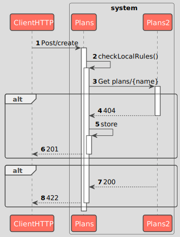
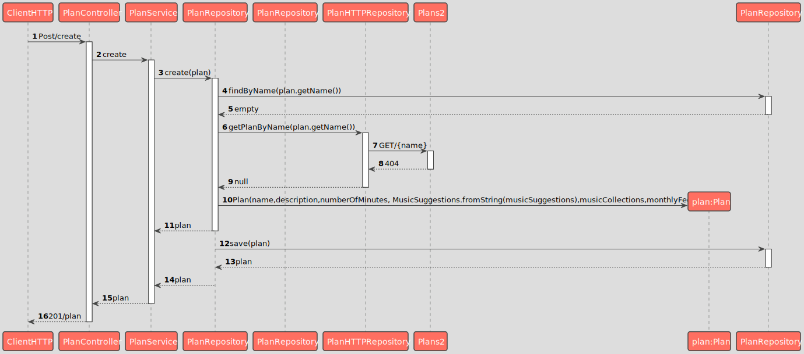

# US 3 - As a Marketing director, I want to create a new plan

### 1.1. User Story Description

As a Marketing director, I want to define a new Plan detailing the monthly and annual cost, the maximum number of devices and other characteristics of the plan
### 1.2. Specifications and Clarifications

**From the specifications document:**

--

**From the Admin clarifications:**

> **Question:**
>Boa tarde, gostaria de saber se o número máximo de dispositivos apresentado na tabela dos planos corresponde ao número máximo de dispositivos que é possível associar à conta/user ou se este número corresponde ao limite de dispositivos ligados ao mesmo tempo à conta/user.
>
> **Answer:**
> boa tarde,
> corresponde ao número máximo de dispositivos associados com a conta

### 1.3. Acceptance Criteria

* AC03-1 - The User must be able to enter the plan name, a brief description as HTML text, the monthly and annual cost of the plan, the maximum number of devices, the maximum number of collections, if it includes music suggestion, and the number of included minutes.
* AC03-2 - The plan name must be unique.

### 1.4. Found out Dependencies

* No dependencies were found

### 1.5 Input and Output Data

**Input Data:**

* Typed data:

  * Plan name
  * Description as HTML text
  * Monthly cost
  * Annual cost
  * Maximum number of devices
  * Maximum number of collections
  * Number of included minutes

* Selected data:

**Output Data:**

* (In)Success of the operation

### 1.6. System Sequence Diagram (SSD)

### 1.7 Other Relevant Remarks

--

## 2. OO Analysis

### 2.2. Other Remarks

n/a

## 3. Design - User Story Realization

## 3.1. Sequence Diagram (SD)

