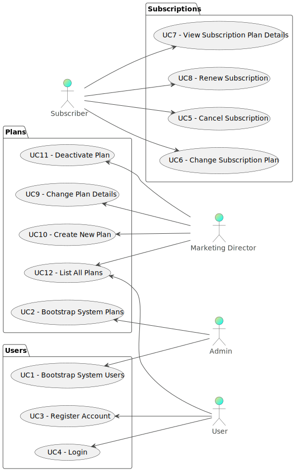

# Use Case Diagram (UCD)

# Use Cases / User Stories
| UC/US | Description                                                      |                   
|:------|:-----------------------------------------------------------------|
| US01  | [As an Admin I want to “bootstrap” user credential data]()       |
| US02  | [As an Admin I want to “bootstrap” plans data]()                 |
| US03  | [As a User, I want to register my account]()                     |
| US04  | [As a User, I want to login]()                                   |
| US05  | [As a Subscriber, I want to cancel my subscription]()            |
| US06  | [As a Subscriber, I want to change my subscription plan]()       |
| US07  | [As a Subscriber, I want to view my subscription plan details]() |
| US08  | [As a Subscriber, I want to renew my subscription]()             |
| US09  | [As a Marketing Director, I want to change plan details]()       |
| US010 | [As a Marketing Director, I want to create a new plan]()         |
| US011 | [As a Marketing Director, I want to deactivate a plan]()         |
| US012 | [As a User, I want to view all plans]()                          |

